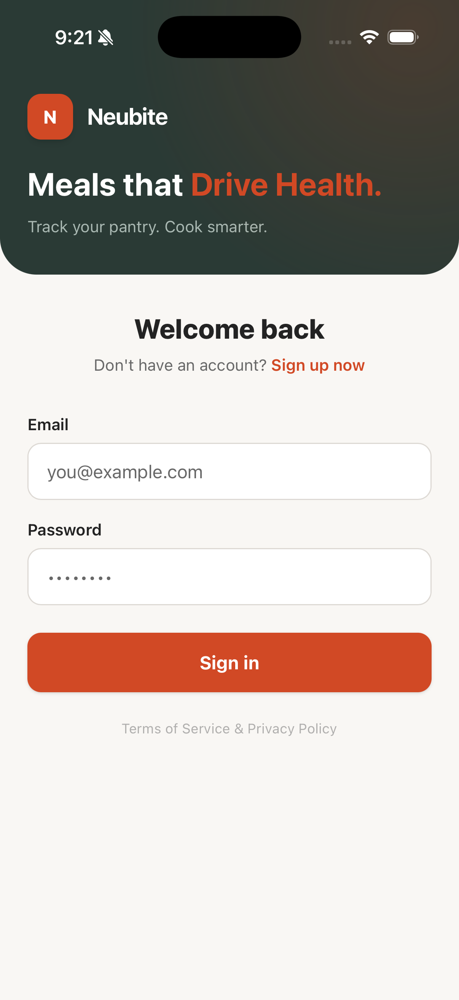
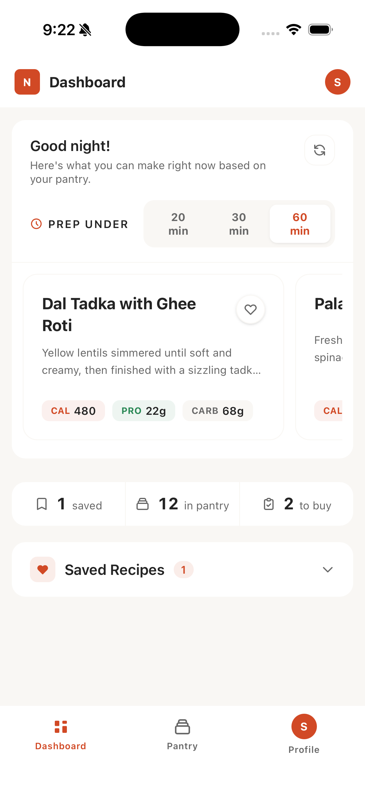
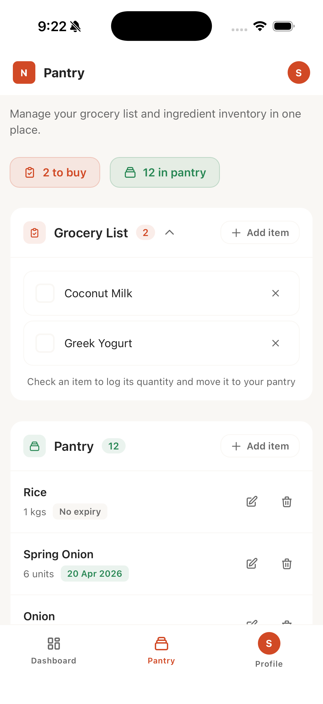
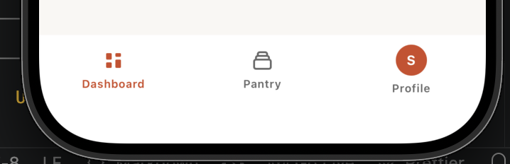

# Neubite — Frontend

Neubite is an AI-powered meal planning app that suggests recipes based on your pantry, time of day, and prep time preference. Built with React + TypeScript, packaged as a native iOS/Android app via Capacitor.

**Demo mode is on by default** — no backend or AWS account needed to run and explore the app locally.

---

## Screenshots

<!-- Screenshot: Login screen -->


<!-- Screenshot: Dashboard — recipe suggestions -->


<!-- Screenshot: Pantry management -->


<!-- Screenshot: Mobile bottom nav -->


---

## Tech Stack

- React 19 + TypeScript + Vite
- Tailwind CSS v4
- Zustand with `persist` middleware
- React Router v7
- Capacitor v8 (iOS & Android)
- AWS Amplify v6 + Cognito (authentication)

---

## Prerequisites

- Node.js ≥ 20, npm ≥ 10
- For iOS builds: Xcode 15+, CocoaPods
- For Android builds: Android Studio + JDK 17

---

## Local Setup

### 1. Install dependencies

```bash
npm install
```

### 2. Configure environment

```bash
cp .env.example .env
```

`.env` values:

```env
# NestJS backend base URL
VITE_API_URL=http://localhost:3000

# AI recipe suggestions endpoint (same as backend if using built-in AI route)
VITE_AI_API_URL=http://localhost:3000

# AWS Cognito — only needed when running in Live mode
VITE_COGNITO_USER_POOL_ID=us-east-1_xxxxxxxxx
VITE_COGNITO_CLIENT_ID=xxxxxxxxxxxxxxxxxxxxxxxxxx
```

> All values are optional for local development. Demo mode is enabled by default and uses seeded mock data — no backend or Cognito setup required.

### 3. Start the dev server

```bash
npm run dev
```

Open [http://localhost:5173](http://localhost:5173). You can log in with any credentials in Demo mode.

---

## Demo Mode

A **Demo / Live** toggle is available in the sidebar (desktop) and the Profile sheet (mobile).

When **Demo** is active (default):
- All API calls are skipped — no backend needed
- Pantry is pre-seeded with mock ingredients (Rice, Onion, Chillies, etc.)
- Recipe suggestions are generated from mock data matched to time of day
- No Cognito credentials required

Switch to **Live** to connect to a real NestJS backend and Cognito user pool.

---

## Available Scripts

| Command | Description |
|---------|-------------|
| `npm run dev` | Start local dev server |
| `npm run build` | Type-check + production build |
| `npm run lint` | Run ESLint |
| `npx vitest` | Run unit tests |

---

## iOS Build

```bash
# Build web app and sync to iOS native project
npm run build
npx cap sync ios

# Open in Xcode, then run on simulator or device
npx cap open ios
```

---

## Android Build

```bash
npm run build
npx cap sync android
npx cap open android
```

---

## Project Structure

```
src/
  app/              # Root layout, router, auth guard
  features/
    auth/           # Cognito auth service (Amplify wrappers)
    recipes/        # Suggestions UI, AI service, mocks, hooks
    grocery/        # Pantry + grocery list, intake modal
  shared/
    api/            # Axios client + API modules per domain
    components/     # Shared UI — icons, meal-time notification
    stores/         # Zustand stores: auth, recipes, pantry/grocery
    utils/          # Mock mode toggle, helpers
```

---

## Environment Variables Reference

| Variable | Required | Description |
|----------|----------|-------------|
| `VITE_API_URL` | No* | NestJS backend base URL |
| `VITE_AI_API_URL` | No* | AI recipe suggestions endpoint |
| `VITE_COGNITO_USER_POOL_ID` | No* | AWS Cognito User Pool ID |
| `VITE_COGNITO_CLIENT_ID` | No* | AWS Cognito App Client ID |

*Not required in Demo mode.
